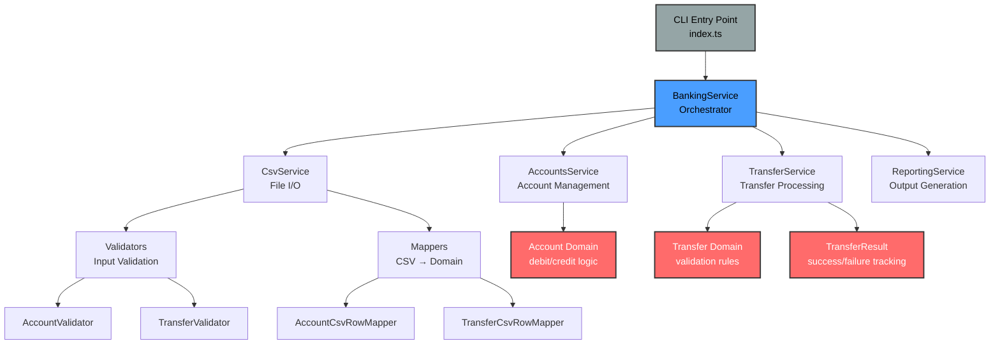
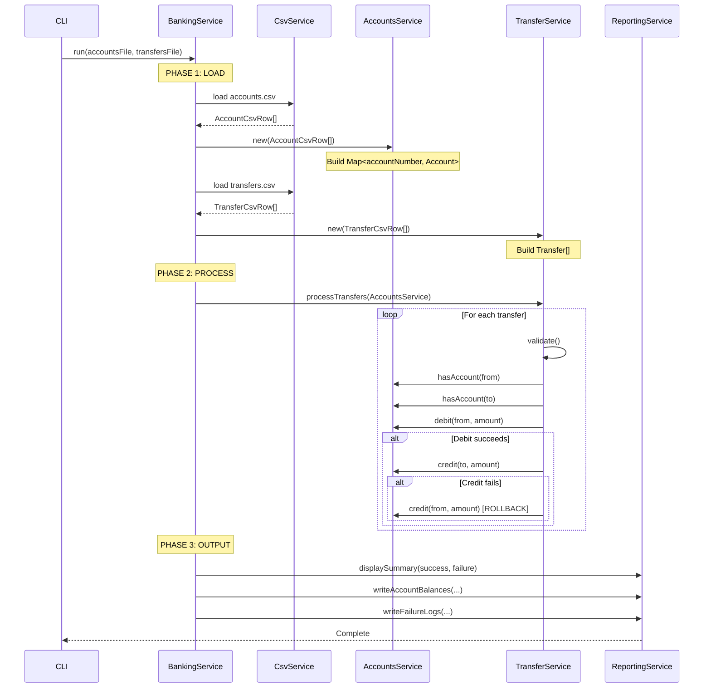

# Mable Banking Service - Architecture Diagrams

## ASCII Architecture (Simple View)

```
┌──────────────────────────────────────────────────────────────┐
│                     BANKING SYSTEM                            │
│                                                                │
│  CLI (index.ts)                                               │
│       │                                                        │
│       ▼                                                        │
│  ┌─────────────────────────────────┐                         │
│  │   BankingService (Orchestrator)  │                         │
│  └──────────┬───────────────────────┘                         │
│             │                                                  │
│    ┌────────┼────────┬──────────┬──────────┐                 │
│    ▼        ▼        ▼          ▼          ▼                 │
│  ┌─────┐ ┌─────┐ ┌──────┐ ┌─────────┐ ┌──────────┐         │
│  │ CSV │ │ Acct│ │Trans │ │ Report  │ │Validator │         │
│  │ Svc │ │ Svc │ │ Svc  │ │ Service │ │ + Mapper │         │
│  └──┬──┘ └──┬──┘ └───┬──┘ └────┬────┘ └─────┬────┘         │
│     │       │        │         │            │                │
│     ▼       ▼        ▼         ▼            ▼                │
│  ┌──────────────────────────────────────────────┐           │
│  │          DOMAIN LAYER                         │           │
│  │   Account[]     Transfer[]    TransferResult │           │
│  │   (Map)                                       │           │
│  └──────────────────────────────────────────────┘           │
│                                                                │
│  INPUT:  accounts.csv, transfers.csv                          │
│  OUTPUT: updated-accounts.csv, failures.log                   │
└──────────────────────────────────────────────────────────────┘
```

---

## Processing Flow

```
1. LOAD
   └─> CSV files → Validators → Mappers → Domain objects

2. PROCESS
   └─> TransferService.processTransfers(AccountsService)
       ├─> Validate transfer
       ├─> Check accounts exist
       ├─> Debit source (with rollback on failure)
       └─> Credit destination

3. OUTPUT
   └─> ReportingService
       ├─> Console summary
       ├─> Write updated account balances
       └─> Write failure logs
```

---

## Mermaid Diagrams (For Professional Rendering)

### Architecture Overview



---

### Data Flow Sequence



---

### Layer Architecture

```mermaid
graph TD
    subgraph "Presentation Layer"
        CLI[CLI<br/>index.ts]
    end

    subgraph "Application Layer"
        BS[BankingService<br/>Orchestrator]
    end

    subgraph "Service Layer"
        CSV[CsvService]
        AS[AccountsService]
        TS[TransferService]
        RS[ReportingService]
    end

    subgraph "Infrastructure Layer"
        VAL[Validators]
        MAP[Mappers]
    end

    subgraph "Domain Layer"
        ACCT[Account<br/>debit/credit]
        TRANS[Transfer<br/>validate]
        RESULT[TransferResult]
    end

    CLI --> BS
    BS --> CSV
    BS --> AS
    BS --> TS
    BS --> RS

    CSV --> VAL
    CSV --> MAP

    AS --> ACCT
    TS --> TRANS
    TS --> RESULT

    style CLI fill:#95a5a6,stroke:#333,stroke-width:2px,color:#000
    style BS fill:#4a9eff,stroke:#333,stroke-width:2px,color:#000
    style CSV fill:#f39c12,stroke:#333,stroke-width:2px,color:#000
    style AS fill:#f39c12,stroke:#333,stroke-width:2px,color:#000
    style TS fill:#f39c12,stroke:#333,stroke-width:2px,color:#000
    style RS fill:#f39c12,stroke:#333,stroke-width:2px,color:#000
    style ACCT fill:#ff6b6b,stroke:#333,stroke-width:2px,color:#fff
    style TRANS fill:#ff6b6b,stroke:#333,stroke-width:2px,color:#fff
    style RESULT fill:#ff6b6b,stroke:#333,stroke-width:2px,color:#fff
```



---
